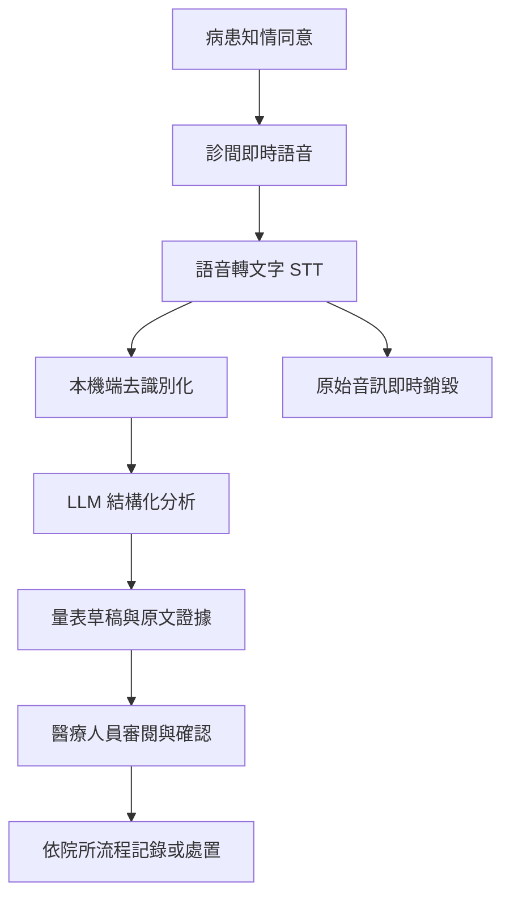

# 隱形溫度計 Invisible BSRS

> 用傾聽取代填表，在醫病對話中協助辨識容易被忽略的心理風險訊號。

「隱形溫度計」是一套醫療對話情緒解析系統。它將診間對話即時轉為文字，從患者的自然敘述中整理與 BSRS-5（簡式健康量表）相關的身心症狀線索，並以視覺化量表及原文證據呈現給醫療人員。

本系統不是診斷工具，也不會自行判定患者是否有自殺意圖。所有結果均為待確認的評估草稿，最終評分、風險判斷與後續處置仍由合格專業人員負責。

## 為什麼需要它？

傳統心理篩檢通常依賴患者自行填寫量表。然而，具有潛在自殺風險或嚴重情緒困擾的患者，可能因防衛、污名、缺乏信任，或不希望被進一步評估，而低報自己的感受。

另一方面，精神科、心理諮商與家醫科的看診時間有限。醫療人員必須在短時間內建立關係、理解主訴並辨識風險；額外填寫問卷有時會打斷原本自然的醫病對話。

隱形溫度計希望補上這個缺口：不取代問卷與臨床訪談，而是將對話中已經出現的線索整理出來，提醒醫療人員哪些地方值得進一步詢問。

## 產品概念

系統分析的核心面向包含：

- 睡眠困難
- 焦慮／緊張
- 易怒
- 憂鬱／心情低落
- 自卑／覺得不如他人
- 自殺意念或自傷風險線索（額外警示，不由 AI 單獨定案）

> BSRS-5 本身包含五個身心症狀題項；自殺意念通常作為額外題項評估。本專案在介面中將兩者清楚區隔，避免造成量表定義混淆。

每一項分析結果都必須同時提供：

1. **建議分數或資訊不足標記**：0–4 分的評估草稿，不足以判斷時不得硬猜。
2. **患者原話**：標示模型做出建議的逐字稿片段。
3. **判斷說明**：簡短解釋原話與該項目的關聯。
4. **信心程度**：提示醫療人員是否需要進一步詢問。
5. **人工確認**：只有經醫療人員確認後，結果才可寫入後續紀錄。

## Demo 情境

### 模擬對話

> 患者：「最近晚上都睡不好，小孩稍微吵一下我就想罵人，覺得自己是個很糟糕的媽媽……」

### 系統處理

1. 將語音即時轉為逐字稿。
2. 移除姓名、電話、地址等可識別資訊。
3. 分析對話中的情緒與身心症狀線索。
4. 產生量表草稿、原文證據及待追問項目。
5. 由醫療人員審閱、修改並確認。

### 畫面呈現

介面以雷達圖或量表呈現各項風險線索。以上述對話為例，「睡眠困難」、「易怒」與「自卑」會被醒目標示，旁邊列出對應的患者原話。沒有足夠證據的項目顯示為「資訊不足」，而不是推測一個分數。

若對話出現自傷或自殺相關線索，介面應立即顯示高優先級提醒，要求專業人員依機構既有流程直接評估；系統不得僅憑模型輸出宣告安全或危險。

## 系統流程



## AI 技術設計

### 核心元件

- **Speech-to-Text**：Whisper API 或其他醫療情境可用的語音辨識服務。
- **Large Language Model**：支援結構化輸出與企業資料保護條款的 LLM。
- **評分準則 Prompt**：提供各題 0–4 分定義、正反例及邊界案例。
- **結構化輸出驗證**：以固定 schema 檢查分數、證據與缺漏欄位。

### 防止幻覺與過度推論

- 每一項評估必須引用可回溯的逐字稿片段。
- 無直接或間接證據時，輸出「資訊不足」，不得補寫患者未說過的內容。
- 將「觀察到的語句」、「模型推論」與「醫療人員確認」分層顯示。
- 自殺風險不得只依單一分數自動排除或確認。
- 保留模型版本、提示版本與人工修改紀錄，以利稽核。
- 以標註案例測試漏報、誤報、否定句、反諷與語境判讀。

### 概念輸出格式

```json
{
  "status": "draft_requires_clinician_review",
  "dimensions": [
    {
      "name": "睡眠困難",
      "suggested_score": 3,
      "confidence": "high",
      "evidence": ["最近晚上都睡不好"],
      "rationale": "患者直接描述近期睡眠困擾"
    },
    {
      "name": "焦慮／緊張",
      "suggested_score": null,
      "confidence": "insufficient",
      "evidence": [],
      "rationale": "目前對話不足以評估"
    }
  ],
  "urgent_review": false
}
```

上述分數僅示意資料結構，不代表正式 BSRS-5 評分結果。

## 目標客群與商業模式

### 目標客群（B2B）

- 精神科與身心科門診
- 心理諮商機構
- 家庭醫學科與基層診所
- 學校輔導中心
- 醫療資訊系統與電子病歷服務商

### 收費模式

- **SaaS 訂閱制**：依帳號數、據點數或每月分析時數收費。
- **API／模組授權**：提供 HIS、EMR 或既有醫療平台整合。
- **私有部署方案**：針對大型院所提供專屬環境、權限控管與稽核功能。

### 價值主張

- 減少醫療人員整理對話與量表草稿的時間。
- 協助發現自然對話中容易被忽略的風險線索。
- 讓評估依據可追溯，方便醫療人員複核與追問。
- 在不打斷對話的前提下，提升篩檢流程的一致性。

「提高篩檢準確率」及「降低事故或醫療糾紛」屬於必須經臨床研究驗證的產品假設，在取得證據前不作為既定成效宣稱。

## 隱私、安全與合規原則

本節是產品設計方向，不構成法律意見。正式開發與商用前，應由台灣醫療器材法規、個資與醫療法律專業人士確認，並與導入機構完成資安及倫理審查。

### 1. 產品定位與人工決策

- 不宣稱系統可以診斷憂鬱症、判定自殺意圖等級或提供治療決策。
- 介面清楚標示「僅供臨床參考，非醫療診斷」。
- AI 只負責整理線索與產生草稿，最終判斷由合格專業人員完成。
- 是否屬於醫療器材軟體，應依實際功能、預期用途、宣稱及當時法規判定；僅稱為 CDSS 並不當然免除醫材監管。

### 2. 敏感資料保護

- 在蒐集或處理前提供清楚告知，並取得適法的知情同意。
- 在資料離開診間設備前，優先以本機端移除姓名、身分證字號、電話、地址與其他可識別資訊。
- 採最小化蒐集、最短保存期限、傳輸與靜態加密、權限分級及存取稽核。
- 使用第三方 AI 服務前確認資料落地區域、次處理者、保存政策、訓練用途及刪除機制。
- 企業方案的「不作模型訓練」不必然等於「零資料保留」，兩者須分別以合約及技術設定確認。

### 3. 錄音與透明性

- 診間與操作介面持續顯示「AI 輔助記錄進行中」。
- 清楚說明蒐集目的、處理方式、保存時間、資料接收者及撤回機制。
- 優先採即時串流處理，完成轉錄後刪除原始音訊；若因醫療或稽核需求必須保存，另行取得依據並限制存取。
- 患者拒絕使用 AI 時，仍應能接受不受影響的醫療服務。

### 4. 臨床安全

- 建立自傷／自殺風險的人工覆核與緊急處置流程。
- 定期評估不同語言、口音、性別、年齡與文化背景造成的模型偏差。
- 對漏報、誤報、服務中斷及資料外洩制定通報與應變程序。
- 在真實患者情境上線前，先完成離線驗證、小規模試辦及機構審查。

## Demo Pitch 建議

建議以一段自然對話作為主線，而不是先介紹模型：

1. **看見問題**：患者沒有主動說「我很憂鬱」，但談到了失眠、易怒與自我否定。
2. **看見系統**：語音成為逐字稿，量表上的相關項目逐一亮起。
3. **看見依據**：評審點開任一項目，都能看到患者說過的原話。
4. **看見界線**：AI 不下診斷，資訊不足就明說，由醫療人員追問與確認。
5. **看見價值**：系統沒有取代傾聽，而是讓傾聽過程中的重要訊號不被漏掉。

一句話收尾：

> 我們不是要讓 AI 決定誰有危險，而是讓每一句不容易說出口的求救，都有機會被專業人員看見。

## 開發路線圖

- [ ] 建立固定的模擬逐字稿與展示流程
- [ ] 定義結構化輸出 schema 與 BSRS-5 評分提示
- [ ] 完成逐字稿、證據引用與量表視覺化介面
- [ ] 加入資訊不足、緊急提醒及人工確認狀態
- [ ] 實作 PII 去識別化與音訊刪除流程
- [ ] 建立標註測試集，評估一致性、漏報與誤報
- [ ] 邀請臨床、法規、資安及個資專家審查
- [ ] 規劃經倫理審查核准的封閉式場域試辦

## 專案狀態

目前為提案與概念驗證階段，Demo 使用事先設計的虛構對話，不輸入真實病患資料，也不作任何臨床用途。

## 重要聲明

本專案旨在探索醫療對話整理與心理風險篩檢的輔助方式，不能取代專業評估、正式量表、診斷或治療。若本人或身邊的人有立即自傷或自殺風險，請立刻聯絡所在地的緊急服務或尋求合格專業人員協助。

## 程式與模型管線

此 repo 也包含一套可執行的原型程式：

- 前端 demo：可貼上逐字稿，快速展示去識別化、情緒線索與 BSRS-5 結果。
- 模型管線：本地 Hugging Face 模型處理語音與個資，最後用 OpenAI API 產生結構化 BSRS JSON。

若你是第一次執行，請先看完整使用教學：[docs/usage.md](docs/usage.md)。

### 目前實作

- 語音轉逐字稿：預設 `faster-whisper` + `Systran/faster-whisper-medium`，比 tiny/small 更穩，並使用量化推論降低顯卡記憶體壓力。
- 語音轉心情：預設 `Dpngtm/wav2vec2-emotion-recognition` 本地語音情緒分類。
- 逐字稿去識別化：預設 `ckiplab/albert-tiny-chinese-ner` 加上 regex 遮蔽個資。
- 逐字稿與心情轉量表：使用 OpenAI API Structured Outputs 產生 `schema_version=1.1.0` 的 BSRS JSON，預設模型為 `gpt-5.6-sol`。
- BSRS system prompt：預設讀取 `prompts/bsrs_system_prompt.txt`，可直接編輯此檔自訂評分角色與原則。

### 執行前端 demo

```powershell
python -m http.server 5173 --bind 127.0.0.1
```

然後開啟 `http://127.0.0.1:5173/`。

### 執行新版聲音到 UI 流程

新版 `UI/` 會直接上傳音檔到本機模型服務，模型服務跑完整管線後回傳正式 BSRS JSON，畫面會自動更新量表。

第一個終端機啟動本機模型服務：

```powershell
.\.venv\Scripts\python.exe -m uvicorn patient_mood_pipeline.web_api:app --host 127.0.0.1 --port 8765
```

第二個終端機啟動新版 UI：

```powershell
cd UI
npm run dev
```

開啟 UI 後按「上傳音檔」。音檔選好後會自動分析，完成時畫面會直接更新量表結果。每次分析會保留音檔與中間結果：

- `outputs/ui_uploads/`：上傳音檔
- `outputs/ui_runs/*_asr_transcript.txt`：語音轉文字
- `outputs/ui_runs/*_deidentified_transcript.txt`：去識別化逐字稿
- `outputs/ui_runs/*_voice_emotion.json`：語音情緒
- `outputs/ui_runs/*_bsrs.json`：量表 JSON

### 執行完整模型管線

```powershell
python -m venv .venv
.\.venv\Scripts\activate
pip install -r requirements.txt
copy .env.example .env
python -m patient_mood_pipeline.download_models
python -m patient_mood_pipeline.run --audio .\samples\conversation.wav --session-id demo-001 --output .\outputs\result.json
```

目前預設使用 `ASR_BACKEND=faster-whisper` 與 `ASR_MODEL_ID=Systran/faster-whisper-medium`，並保留 `ASR_NUM_BEAMS=5` 來提高辨識穩定度。若硬體不足才降回 `openai/whisper-small` 或 `openai/whisper-tiny` 並把 `ASR_BACKEND` 改回 `transformers`。

若要自訂逐字稿轉量表的 GPT system prompt，編輯 `prompts/bsrs_system_prompt.txt`，並確認 `.env` 有：

```powershell
OPENAI_BSRS_MODEL=gpt-5.6-sol
OPENAI_BSRS_REASONING_EFFORT=xhigh
BSRS_SYSTEM_PROMPT_FILE=prompts/bsrs_system_prompt.txt
```

改完後重新啟動本機模型服務。

詳細架構請看 `docs/architecture.md`。

正式輸出的 JSON 頂層會是：

- `session`
- `instrument`
- `assessment.core_items`
- `assessment.core_result`
- `assessment.supplemental_item`
- `clinical_review`
- `analysis_metadata`

其中 `core_result.total_score` 只加總前五題；`suicide_ideation` 是第六題附加題，不納入五題總分。
