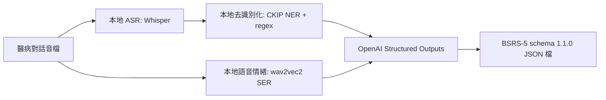

# 模型管線架構

目標資料流：



## 預設模型

| 模組 | 預設模型 | 說明 |
| --- | --- | --- |
| 語音轉逐字稿 | `openai/whisper-small` | 本地 ASR，可改 `openai/whisper-tiny` 降低硬體需求，或改 `openai/whisper-large-v3` 提高品質。 |
| 逐字稿去識別化 | `ckiplab/albert-tiny-chinese-ner` | 繁中 NER 小模型，搭配 regex 遮蔽電話、身分證、地址、日期、email 等。 |
| 語音轉心情 | `Dpngtm/wav2vec2-emotion-recognition` | 本地語音情緒分類，輸出 dominant emotion、arousal、valence。 |
| 逐字稿與心情轉量表 | `OPENAI_BSRS_MODEL` | 只送去識別化逐字稿與語音情緒摘要，使用 JSON schema 輸出 `schema_version=1.1.0` 報告。 |

## 執行

```powershell
python -m venv .venv
.\.venv\Scripts\activate
pip install -r requirements.txt
copy .env.example .env
```

在 `.env` 放入 `OPENAI_API_KEY` 後，先下載模型：

```powershell
python -m patient_mood_pipeline.download_models
```

跑完整管線：

```powershell
python -m patient_mood_pipeline.run --audio .\samples\conversation.wav --session-id demo-001 --output .\outputs\result.json
```

如果手上已有逐字稿，可以跳過 ASR：

```powershell
python -m patient_mood_pipeline.run --transcript-file .\samples\transcript.txt --output .\outputs\result.json
```

只測本地模型，不呼叫 OpenAI：

```powershell
python -m patient_mood_pipeline.run --audio .\samples\conversation.wav --local-only
```

## 隱私邊界

預設輸出的 JSON 不保存原始逐字稿，也不把原始逐字稿送到 OpenAI。只有去識別化逐字稿與本地語音情緒摘要會進入最後的量表評分步驟。

若需要除錯才使用 `--include-raw`，這會把原始逐字稿寫進本機 JSON。

## 正式輸出格式

完整流程的輸出檔會直接是 BSRS-5 評估草稿：

- `assessment.core_items`：五個核心題目，依臺北市線上版題序：睡眠困擾、緊張不安、容易苦惱或動怒、憂鬱或心情低落、覺得比不上別人。
- `assessment.core_result.total_score`：只加總五個核心題目的 `value.estimated_score`，範圍 0-20。
- `assessment.core_result.distress_level`：依 0-5、6-9、10-14、15-20 分級。
- `assessment.supplemental_item`：第六題 `suicide_ideation`，獨立為 0-4 分，不納入總分。
- `clinician_confirmation.confirmed_score`：保留給醫療人員填入正式分數。

`--local-only` 會跳過 OpenAI 並輸出本地中間結果，用於測試模型下載、ASR、去識別化和語音心情分類。
